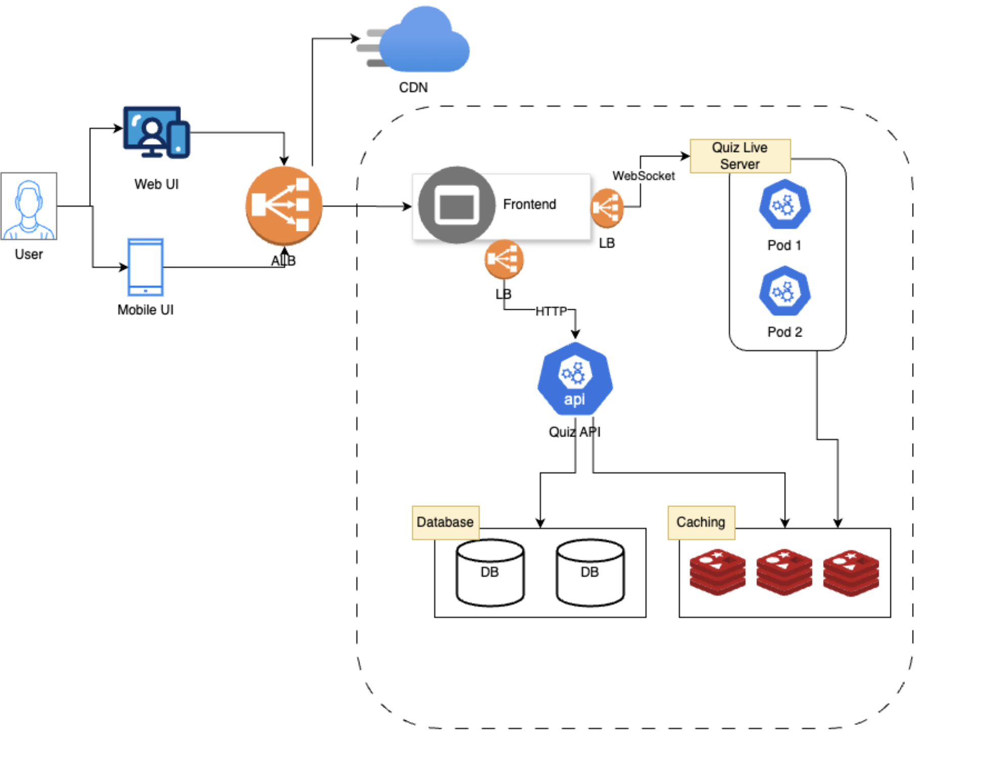

# Design architecture Quiz System
- [issue link](https://github.com/huylqvn/RealTimeQuiz/issues/1)

## 1. Overview
- This is a technical solution for a real-time quiz feature for an English learning application. This feature will allow users to `answer questions in real-time, compete with others, and see their scores updated live on a leaderboard`

## 2. Functional requirements

- User Participation:
-- Users should be able to join a quiz session using a unique quiz ID.
-- The system should support multiple users joining the same quiz session simultaneously.

- Real-Time Score Updates:
-- As users submit answers, their scores should be updated in real-time.
-- The scoring system must be accurate and consistent.

- Real-Time Leaderboard:
-- A leaderboard should display the current standings of all participants.
-- The leaderboard should update promptly as scores change.

## 3. Non-functional requirements
- Scalability: Design and implement your component with scalability in mind. Consider how the system would handle a large number of users or quiz sessions. Discuss any trade-offs you made in your design and implementation.
  
- Performance: Your component should perform well even under heavy load. Consider how you can optimize your code and your use of resources to ensure high performance.
  
- Reliability: Your component should be reliable and handle errors gracefully. Consider how you can make your component resilient to failures.
  
- Maintainability: Your code should be clean, well-organized, and easy to maintain. Consider how you can make it easy for other developers to understand and modify your code.
  
- Monitoring and Observability: Discuss how you would monitor the performance of your component and diagnose issues. Consider how you can make your component observable.

## 4. Resources Estimation

#### 4.1 Factors Affecting Resource Requirements:
- Question Type: Multiple choice, fill-in-the-blank, or questions containing images, audio, or video.
- How often users join a quiz.
- User Answer Submission Frequency (per minute)

#### 4.2 System Assumptions:
- Supports 1,000,000 concurrent users.
- Users submit 1 answer per minute.
- On average, 10 users participate in a question per minute.
- Questions are multiple-choice, text-only (no image, audio, or video support) with a maximum length of 4,000 characters.
  
#### 4.3 Resources
- Bandwidth: 1,000,000 users connected via sockets, assuming a 10Kb request size per message, translates to 10GB/s bandwidth.
- RPS (Requests Per Second): With 1 answer per minute per user, this translates to 100k requests/minute = 1667 requests/second.
- CPU: Assuming a 10ms processing time per request, this translates to 1667 requests/second * 10m/request = 16670m, roughly equivalent to 17 CPU cores.
- RAM: Each user joins 10 questions, resulting in 10 * 4Kb/user = 40Kb per user. With 1,000,000 users, this translates to 40Kb/user * 1,000,000 users = 40GB RAM.
- Database: Assuming 30 days of data retention, this translates to 40GB * 30 days = 1.2TB storage.
=> These are estimations based on assumptions. Real-world usage maybe different. Monitoring and scaling down the system based on actual usage.

#### 4.4 Server Allocation

- Cluster:

-- Number of Servers: 2
-- CPU: Each server: 16 cores (total: 32 cores)
-- RAM: Each server: 32GB (total: 64GB)
-- Hard Drive: Each server: 1TB SSD (total: 2TB SSD)

- Resource Allocation:

-- Service Server: 17 CPU cores, 40GB RAM, 0TB SSD
-- Database Server: 15 CPU cores, 24GB RAM, 2TB SSD

## 6. Design System Architecture

### Component Descriptions

- ALB: Application Load balancer
- CDN: Content Delivery Network
- Frontend: Allow users interact with the application
- Quiz live server: Maintains user sessions and handles real-time logic
- Quiz API: Handle logic don't require real-time interaction
- Database: Store and retrieve data
- Caching: Cache data to improve performance 

